# Sweeper
My old "minesweeper" game.

## Disclaimer
- This was my first serious IT project, so it contains tons of bad (and strange) coding.
I tried to improve it, but soon realized that I had too much troubles with Swing framework.
- Switching scale has some troubles owing to code enhancement (which is not finished). After starting a new game
all the elements are located correctly.

## Rules
According to [Wikipedia article](https://en.wikipedia.org/wiki/Minesweeper_(video_game)):

> The objective of the game is to clear a rectangular board containing hidden "mines" or bombs without
> detonating any of them, with help from clues about the number of neighboring mines in each field.

> In Minesweeper, mines _(...)_ are scattered throughout a board, which is divided into cells. Cells have three
> states: uncovered, covered and flagged. A covered cell is blank and clickable, while an uncovered cell is
> exposed. Flagged cells are those marked by the player to indicate a potential mine location.

> A player left-clicks a cell to uncover it. If a player uncovers a mined cell, the game ends, as there is
> only 1 life per game. Otherwise, the uncovered cells displays either a number, indicating the quantity of
> mines adjacent to it, or a blank tile _(...)_, and all adjacent non-mined cells will automatically be
> uncovered. Right-clicking on a cell will flag it, causing a flag to appear on it. Flagged cells are still
> considered covered, and a player can click on them to uncover them, although _(...)_ they must first be
> unflagged with an additional right-click.

> The first click in any game will never be a mine.

> To win the game, players must uncover all non-mine cells, at which point, the timer is stopped. Flagging
> all the mined cells is not required.

## Screenshots
New game text

Open cells text

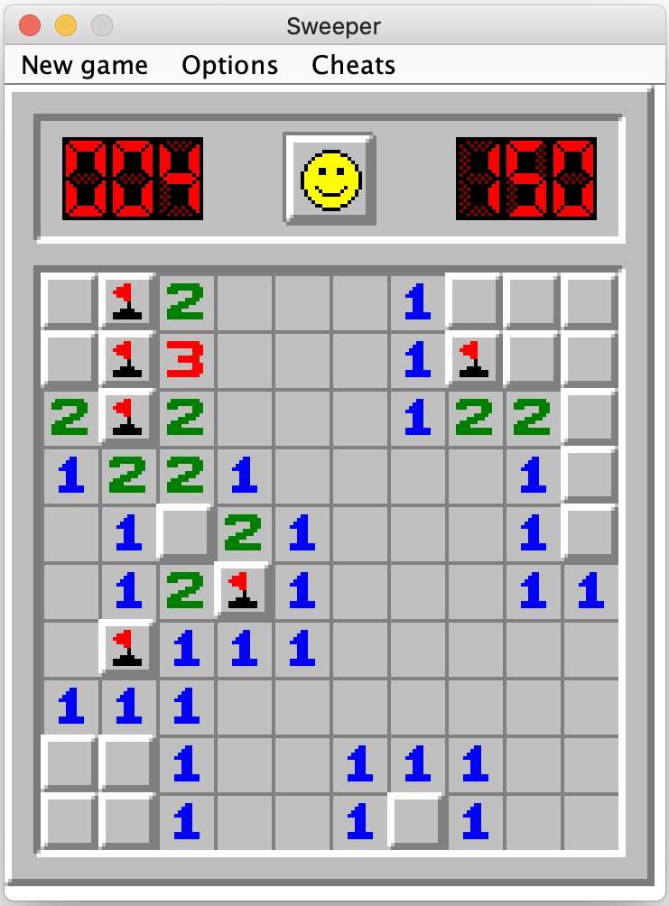 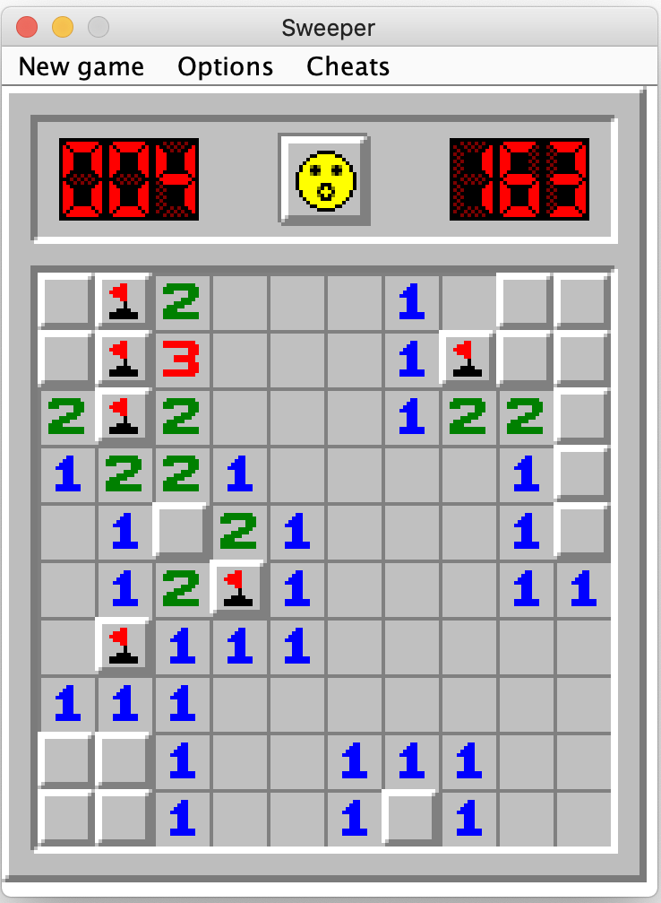

Left+right click text

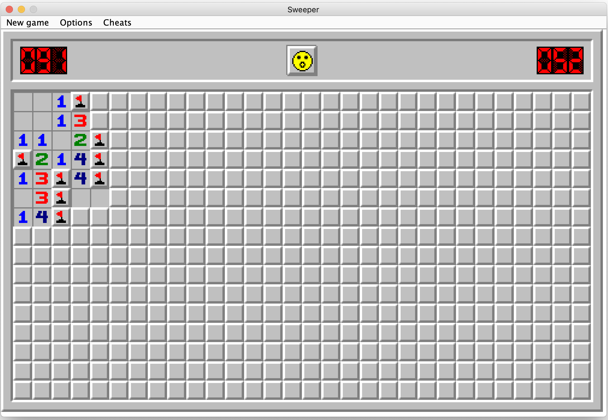

Win text

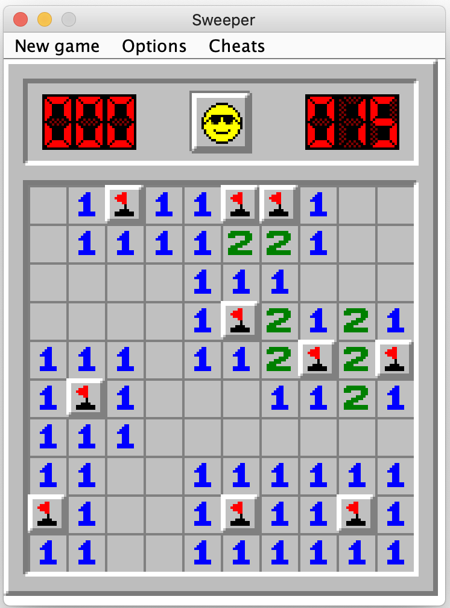

Lose text

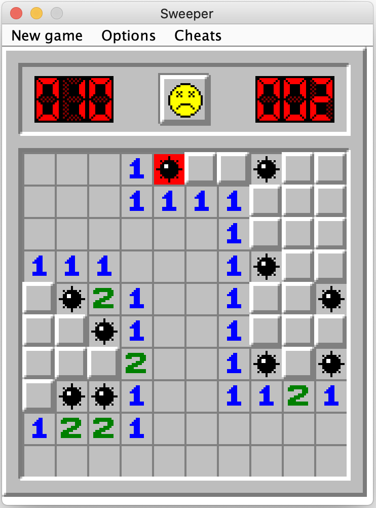

New game menu text

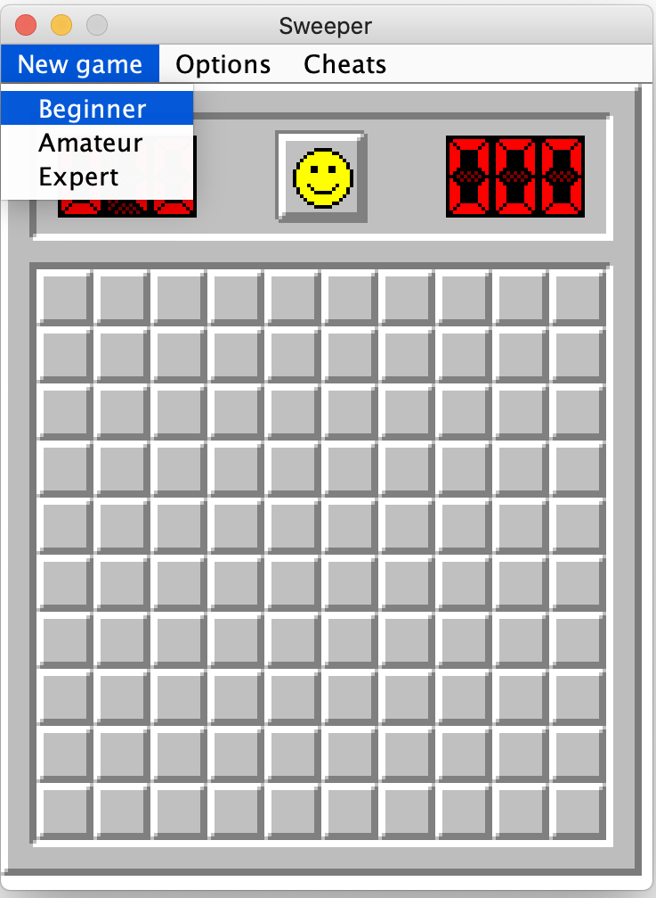

Amateur level has 16x16 field with 40 mines:

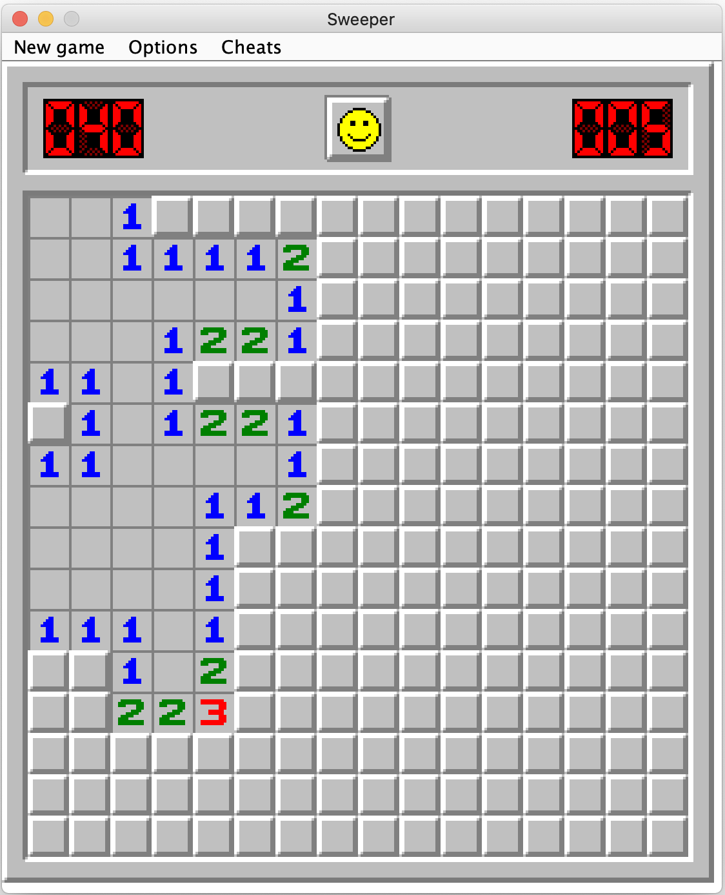

Expert level has ...:

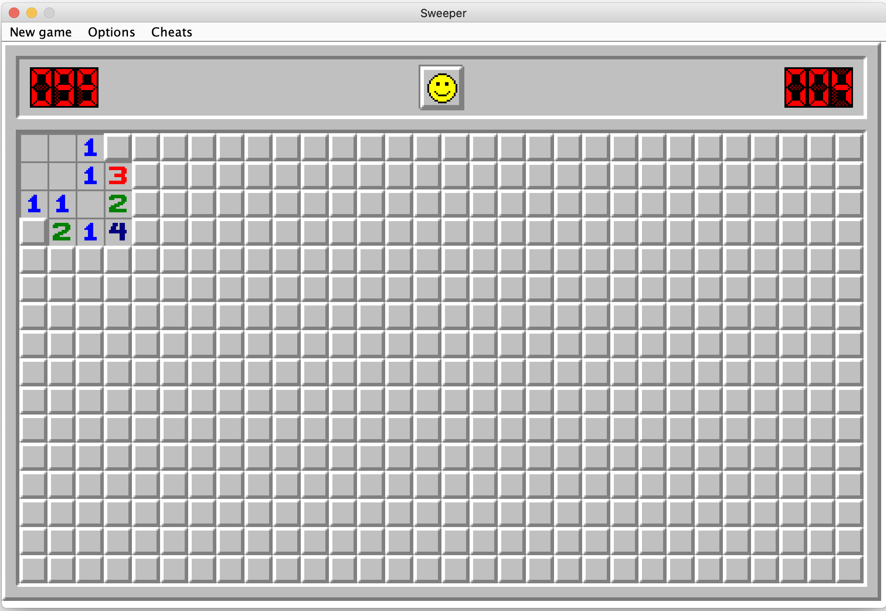

You can change scale of the game:

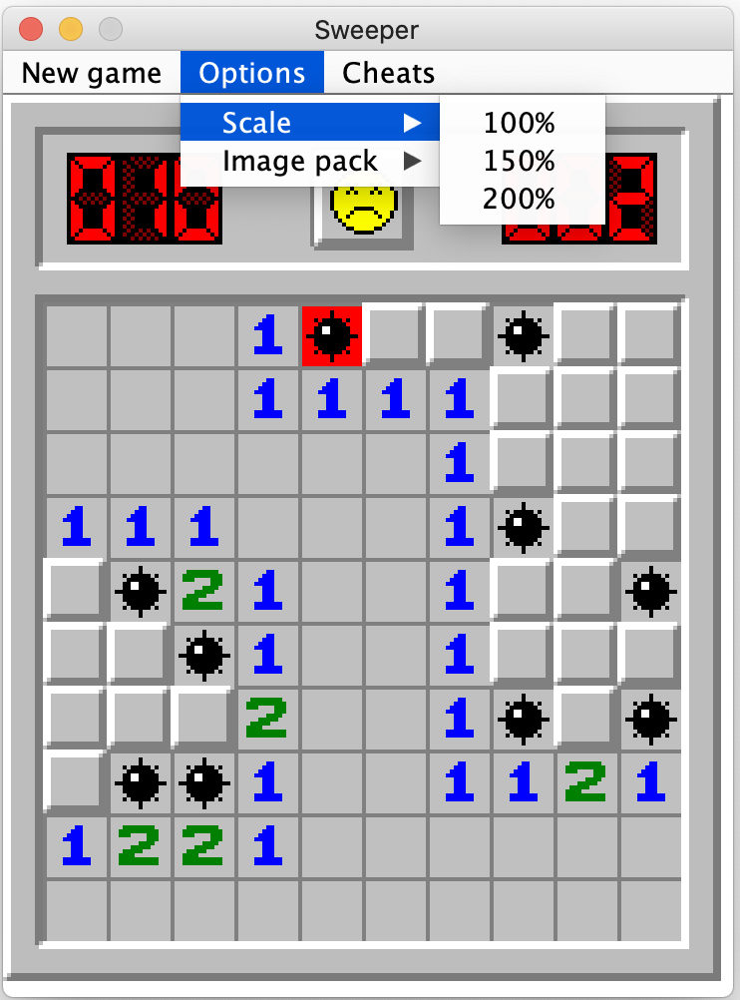

The default scale is 200%.
The game has different textures for 150% scale:

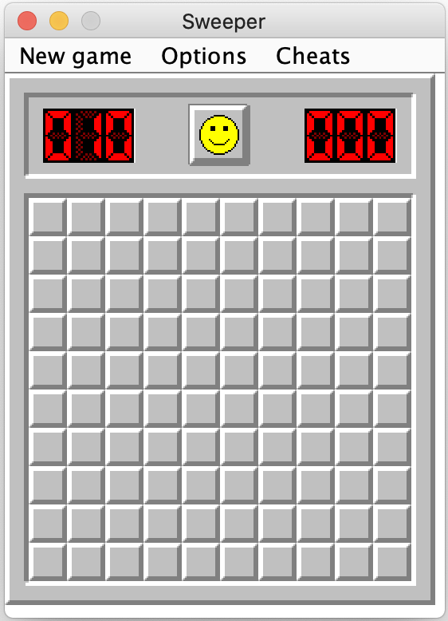 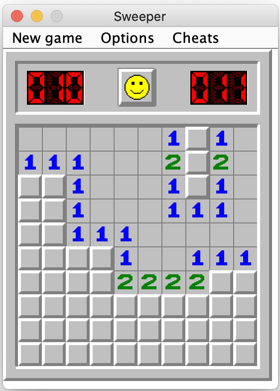

And also you can change your image pack:

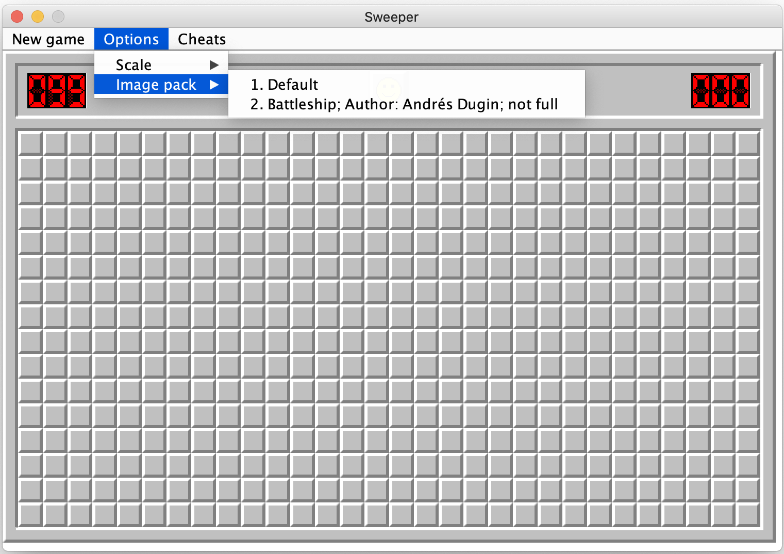

My friend made these textures special for me:

And there's cheats menu:

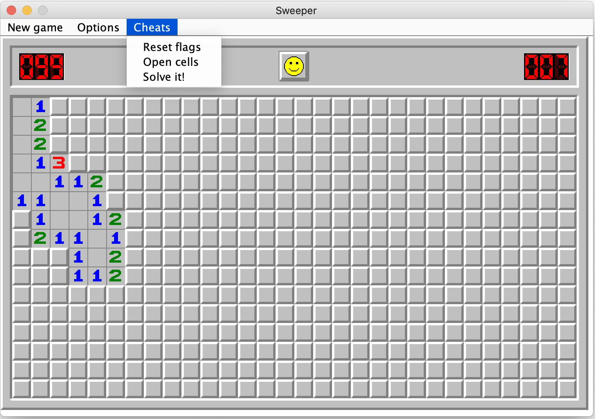

- **Reset flags** option removes all current marks and sets obvious flags.
- **Open cells** opens all the cells which are obviously safe to open according to the flags.
- **Solve it!** tries its best to pass the game as far as possible.

Unfortunately, all these functions became glitchy for now due to my attempts to improve the game.

## Download
You can download [runnable jar-file](out/artifacts/Sweeper_jar). Current version works on my Mac, but I'm not sure about Windows. 

