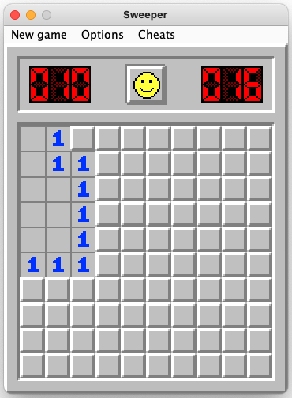
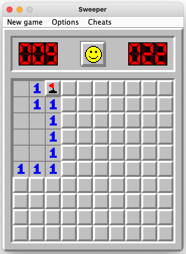
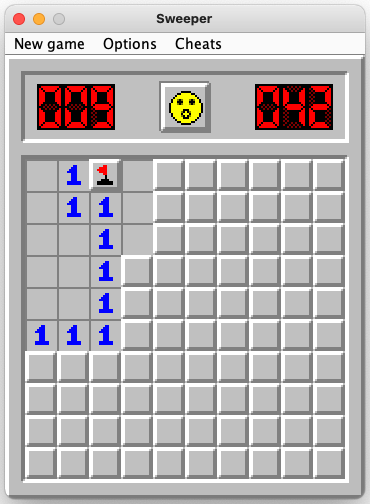
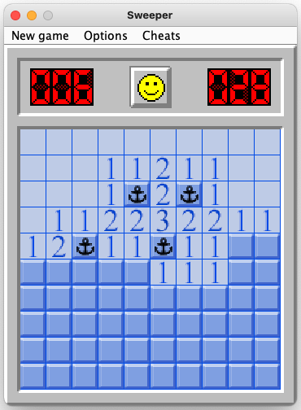

# Sweeper
My old "minesweeper" game.

## Disclaimer
- This was my first serious IT project, so it contains tons of bad (and strange) coding.
I tried to improve it, but soon realized that I had too many troubles with Swing framework.
- Switching scale has some troubles owing to code enhancement (which is not finished). After starting a new game all the
elements are located correctly.

## Rules
_Text for this paragraph is taken from [Wikipedia article](https://en.wikipedia.org/wiki/Minesweeper_(video_game)) with
slight editing._

The objective of the game is to clear a rectangular board containing hidden "mines" or bombs without detonating any of
them, with help from clues about the number of neighboring mines in each field.

In Minesweeper, mines are scattered throughout a board, which is divided into cells. Cells have three states: uncovered,
covered and flagged. A covered cell is blank and clickable, while an uncovered cell is exposed. Flagged cells are those
marked by the player to indicate a potential mine location.

A player left-clicks a cell to uncover it. If a player uncovers a mined cell, the game ends, as there is only 1 life per
game. Otherwise, the uncovered cells displays either a number, indicating the quantity of mines adjacent to it, or a
blank tile, and all adjacent non-mined cells will automatically be uncovered. Right-clicking on a cell will flag it,
causing a flag to appear on it. Flagged cells are still considered covered, and a player can click on them to uncover
them, although they must first be unflagged with an additional right-click.

The first click in any game will never be a mine.

To win the game, players must uncover all non-mine cells, at which point, the timer is stopped. Flagging all the mined
cells is not required.

## Tutorial

The game window has four elements: minefield, two counters and a smile.

- **Minefield** consists of cells, some of which contain mines.
- **Counter on the left** is a mine counter. It shows how many mines are located on the field minus quantity of cells
you marked as flags. In other words, you can see how many mined cells are left to be revealed.
- **Counter on the right** is a stopwatch that measures your solving speed. It starts when the game starts and stops
when the game ends.
- **Smile button** can be pressed any time to reset field and start a new game with the same parameters.

Use left-click on a cell to open it. To start the game, open any cell.

Empty cells (without a digit) are cells that have no adjacent mines. When an empty cell is opened, it opens all the
surrounding cells automatically.

Notice that stopwatch (counter on the right) has started.

A flag appears after right-clicking on a cell:

Notice that mine counter (on the left) has decreased by one.

If you marked all adjacent mines for the cell, you can *click this cell with both left and right mouse keys*.
This will open *all the other adjacent cells*.

This function helps to improve your speed a lot! And it works *only if number in the cell is equal to quantity of
flagged cells around it*; so don't be afraid of misclicking or flagging incorrect number of cells.

On images below, this click is being made on "1" cell that is right under the flag:

You uncover all the cells without mines - you win:

You open a cell with mine - you lose:

Crossed out mines represent cells that contained no mine but were flagged.

The game has 3 difficulty levels. Switching between them is available from `New game` menu.

`Beginner` level is default and has 10x10 field with 10 mines; density is one mine per 10 cells.

`Amateur` level has 16x16 field with 40 mines; density is one mine per 6.4 cells:

`Expert` level has 30x16 field with 99 mines; density is one mine per 4.85 cells:

`Options` item in the menu allows you to change scale:

The default scale is 200%.

The game has different textures for 150% scale:

From `Options` you can also change your image pack:

I asked my friend to draw textures for me. He made this *"Battleship"* pack:

And of course there's `Cheats` menu:

- `Reset flags` removes all current marks, then detects and sets obvious flags.
- `Open cells` opens all the cells which are obviously safe to open according to the flags.
- `Solve it!` tries its best to pass the game as far as possible.

Unfortunately, these functions became glitchy for now due to my work on improving the code.

## Download
You can download [runnable jar-file](out/artifacts/Sweeper_jar). Current version works with Java 10 on my Mac, but I'm
not sure about Windows. 
